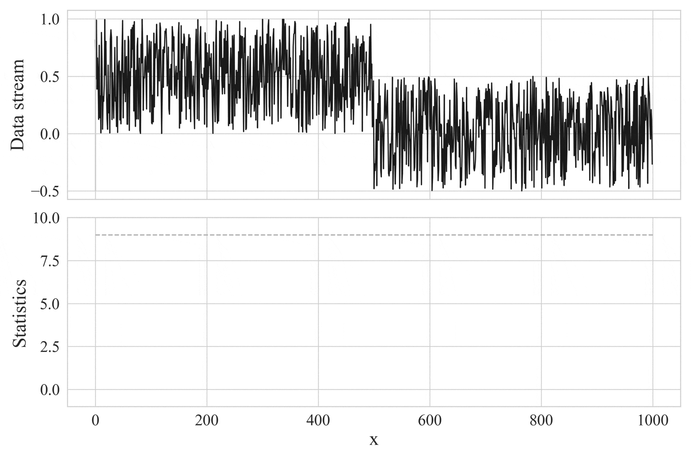
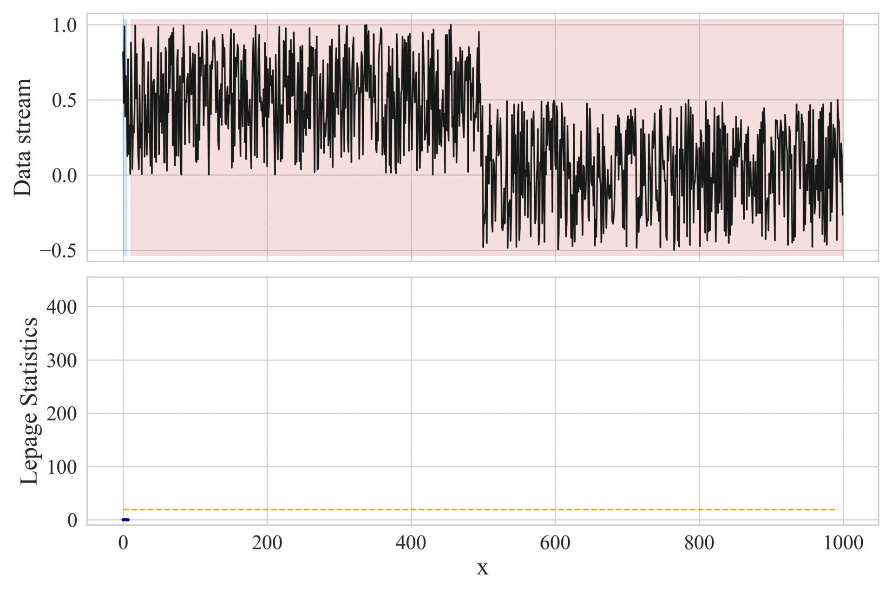

<p align="center">
  <h1 align="center">Change Detection: <i>pyCUSUM</i> and <i>pyCPM</i></h1>  
</p>

[](https://www.python.org/)
[](https://www.python.org/dev/peps/pep-0008/)
[](http://makeapullrequest.com)
[](https://github.com/antoninomariarizzo/change-detection/blob/main/LICENSE)


<div style="text-align: center;">
    
    <p><em>Fig. 1: Execution example our pyCUSUM.</em></p>
</div>

<div style="text-align: center;">
    
    <p><em>Fig. 2: Execution example of our pyCPM with Lepage test.</em></p>
</div>


### Introduction
**Change Detection (CD)** refers to identifying shifts in the distribution of a monitored data stream [1]. 
In this context, we focus on detecting _abrupt_ and _permanent_ changes in a _univariate_ data stream.

This repository implements two widely used CD methods: the _Cumulative Sum_ (CUSUM) [2] and the _Change-Point Model_ (CPM) [3, 4]. 
To highlight that these methods are fully implemented in Python, we have named them **pyCUSUM** and **pyCPM**, respectively. 
Examples of their execution are illustrated in _Fig. 1_ and _Fig. 2_, respectively.
 
We chose to implement these methods because both are _non-parametric_, meaning they can monitor data without assuming any specific distribution. 
Specifically, CUSUM enables sequential monitoring for online analysis of data as it arrives. 
On the other hand, CPM enables batch-wise monitoring, where all data is available upfront for offline analysis, resulting in better performance.

We also compared our pyCPM with the CPM version available in the _R_ library [4], showing that the difference between the two is negligible. 
Therefore, Python users can avoid installing the R version and use our pyCPM instead.


### Install
1. Clone our repository

2. Install required libraries by running `pip install -r requirements.txt`
3. Install our package in editable mode by running:
`pip3 install -e .` from the root folder.


### Usage
All the steps to generate and monitor a data stream are outlined in the Jupyter notebook `change_detection.ipynb`. Specifically:

- **Data Stream Generation**: A synthetic data stream with an abrupt and permanent change in mean is generated. This is achieved using the function in `src/data.py`.
- **Change Detection**: Comparison between the **CUSUM** and **CPM** methods.
- **CPM Comparison**: Comparison between our **CPM** implementation and the version available in the R library.

The implementations of both **CUSUM** and **CPM** are located in the `src/` folder:
- `src/CUSUM.py` – Our implementation of the CUSUM method.
- `src/CPM.py` – Our implementation of the CPM method. Within CPM, we use the _Mann-Whitney U_, _Mood_, and _Lepage_ tests, which are implemented in `src/StatisticalTest.py`.


Additionally, `src/cpm_r_comparison.py` calls the _R_ implementation of CPM. Please note that to run this comparison, _R_ must be installed.

We also include **visualizations** to illustrate the performance of each method. Plotting functions can be found in `src/Plotter.py`.


### Citation

If you use our code in a scientific publication, we would appreciate citations using the following format:
```cit
@misc{rizzo2024:change_detection,
  author    = {Antonino Maria Rizzo},
  title     = {Change Detection: pyCUSUM and pyCPM},
  year      = {2024},
  url       = {https://github.com/antoninomariarizzo/change-detection},
}
```


### References:

[1] Basseville, M., and Nikiforov, I. _Detection of abrupt change: Theory and application._ Prentice-Hall, Inc. (1993).

[2] Tartakovsky, A., Nikiforov, I., and Basseville, M. _Sequential analysis: Hypothesis testing and changepoint detection._ Chapman & Hall. (2014).

[3] Ross, G., Tasoulis, D., and Adams, N. _Nonparametric monitoring of data streams for changes in location and scale._ Technometrics. (2012).

[4] Ross, G. J. _Parametric and nonparametric sequential change detection in R: The cpm package._ Journal of Statistical Software. (2015).